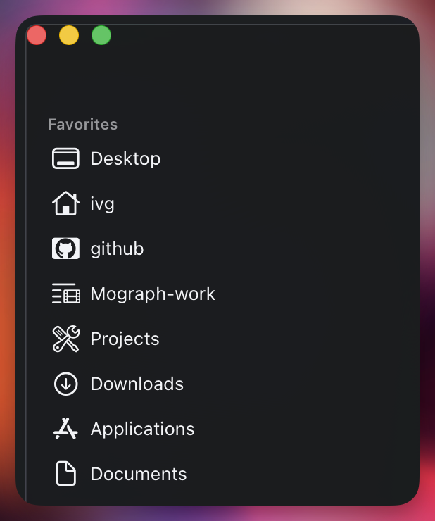
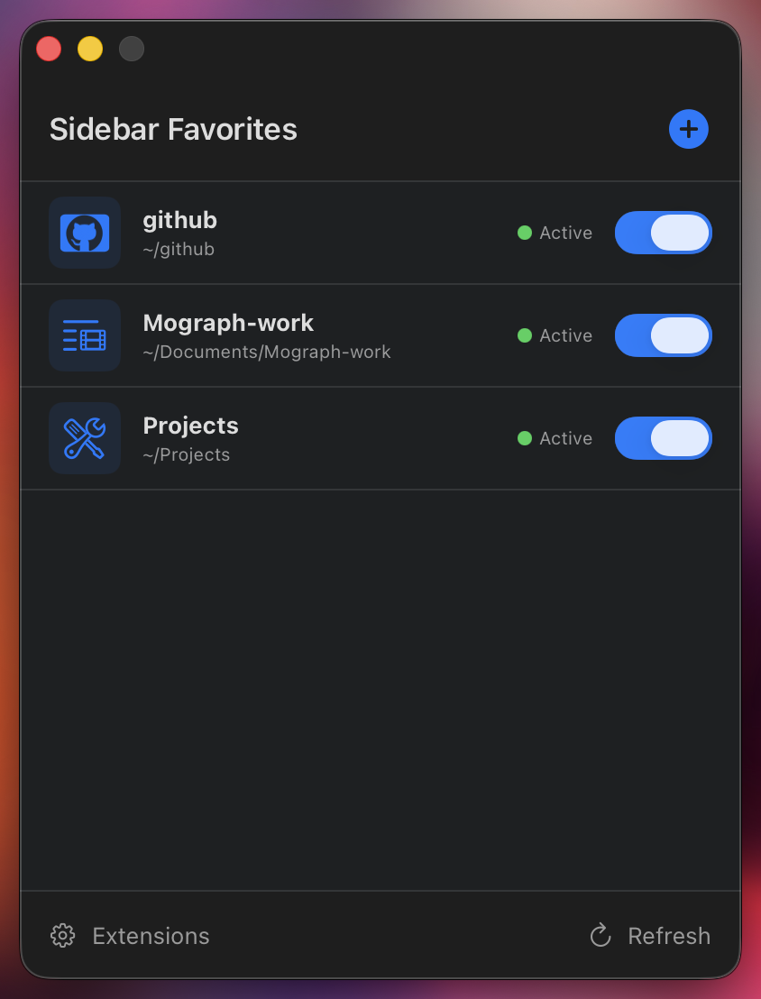
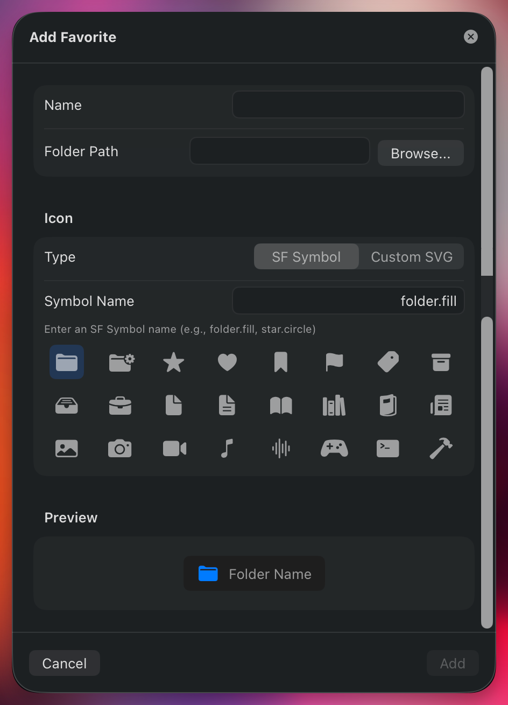
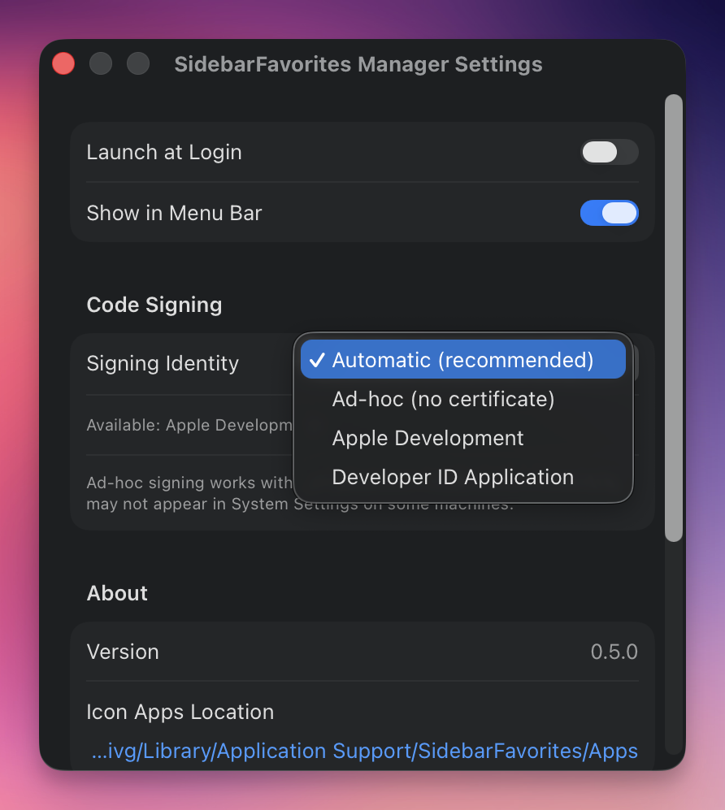

# SidebarFavorites

Add custom folders to macOS Finder's sidebar with custom designed and/or SF Symbol icons.


## Demo

https://github.com/user-attachments/assets/227c2f6d-0cd1-40fa-88e5-d5e66bb2aad7

## Overview

SidebarFavorites lets you customize the Finder sidebar with your own icons. Instead of seeing generic folder icons, you can display any SF Symbol (including custom ones) for your favorite folders.



## Features

- **Custom SF Symbol Icons**: Use any built-in SF Symbol or create your own
- **Multiple Favorites**: Manage as many custom sidebar folders as you want
- **Manager App**: Easy-to-use GUI for adding and managing favorites
- **Automatic Generation**: The Manager app automatically creates and configures icon apps
- **Persistent**: Icons survive restarts and Finder relaunches



## How It Works

macOS Finder Sync extensions can provide custom icons for folders in the sidebar. This project leverages the `CFBundleSymbolName` property to display SF Symbols. Each favorite folder requires its own small app bundle with a Finder Sync extension.

The **SidebarFavorites Manager** app automates this process:
1. You specify a folder path and choose an icon
2. The Manager generates a dedicated icon app from a template
3. The icon app's extension monitors your folder
4. When you drag the folder to Favorites, it shows your custom icon

### Do I Need to Keep the Manager Running?

**No!** The Manager app is only needed for setup and configuration. Once you've:
1. Added your favorites
2. Enabled the extensions in System Settings

You can close the Manager app. The sidebar icons will:
- **Persist across reboots** - macOS automatically restarts FinderSync extensions
- **Work independently** - The icon apps run as separate processes managed by the system
- **Survive Finder restarts** - Icons reappear automatically

**The Manager app is only needed when you want to:**
- Add, edit, or delete favorites
- Troubleshoot extension issues
- Export custom icon templates

## Installation

### Requirements

- macOS 13.0 (Ventura) or later
- **No Apple Developer certificate required** - The app uses ad-hoc signing by default. For best results (extensions appearing in System Settings), an Apple Developer certificate is recommended but optional.

### Option 1: Download Pre-built DMG (Recommended)

1. Download the latest DMG from [Releases](https://github.com/ivg-design/SidebarFavorites/releases)
2. Open the DMG and drag **SidebarFavorites Manager** to Applications
3. **First run**: Right-click the app → Open → Click "Open" in the dialog (required once for unsigned apps)

No Xcode or developer tools needed!

### Option 2: Build from Source

Requires Xcode 15+ and [XcodeGen](https://github.com/yonaskolb/XcodeGen).

```bash
# Clone the repository
git clone https://github.com/ivg-design/SidebarFavorites.git
cd SidebarFavorites

# Install XcodeGen if needed
brew install xcodegen

# Generate Xcode project
xcodegen generate

# Build the Manager app (Release configuration)
xcodebuild -scheme SidebarFavoritesManager -configuration Release

# The built app is at:
# ~/Library/Developer/Xcode/DerivedData/SidebarFavorites-*/Build/Products/Release/SidebarFavorites Manager.app
```

To create a distributable DMG:
```bash
./scripts/build-release.sh
```

### Option 3: Nix (Flakes)

For [Nix](https://nixos.org/) users on macOS:

```bash
# Run directly
nix run github:ivg-design/SidebarFavorites

# Or install to your profile
nix profile install github:ivg-design/SidebarFavorites

# Or add to your flake.nix inputs
{
  inputs.sidebarfavorites.url = "github:ivg-design/SidebarFavorites";
}
```

*Thanks to [@rohanp2051](https://github.com/rohanp2051) for the initial Nix package!*

## Usage

### Using the Manager App

1. **Launch** SidebarFavorites Manager
2. **Add a Favorite**: Click the `+` button
3. **Configure**:
   - **Name**: Display name for the favorite
   - **Folder Path**: Click Browse or enter path (supports `~`)
   - **Icon**: Choose an SF Symbol or import a custom SVG
4. **Save**: The Manager generates the icon app automatically
5. **Enable Extension**: Go to System Settings → Login Items & Extensions → Extensions → Finder and enable your new favorite
6. **Add to Sidebar**: Drag the folder to Finder's Favorites section



### Using Custom SF Symbol Icons

1. Create your symbol using the [SF Symbols app](https://developer.apple.com/sf-symbols/)
2. Export as SVG template (File → Export Symbol)
3. Edit the SVG in your preferred editor
4. Import via the Manager app's "Custom SVG" option

**Important**: The symbol name is defined inside the SVG file in the `descriptive-name` field. This name is automatically extracted during import.

## Project Structure

```
SidebarFavorites/
├── SidebarFavoritesManager/    # Main GUI application
│   ├── Models/                 # Data models (Favorite, etc.)
│   ├── Views/                  # SwiftUI views
│   └── Services/               # Icon generation, lifecycle management
├── IconAppTemplate/            # Template for generated icon apps
│   ├── IconApp/                # Main app bundle template
│   └── FinderSync/             # Finder Sync extension template
├── SidebarFavorites/           # Standalone prototype app
├── SidebarFavoritesSync/       # Prototype's Finder Sync extension
├── scripts/                    # Utility scripts
├── icons/                      # Example SF Symbol SVGs
└── docs/                       # Technical documentation
```

## Technical Details

### Key Concepts

- **CFBundleSymbolName**: The `Info.plist` key that specifies the SF Symbol to use as the app icon (and sidebar icon)
- **Finder Sync Extension**: An app extension type (`com.apple.FinderSync`) that can monitor folders and provide UI integration
- **Assets.car**: Compiled asset catalog containing custom SF Symbols

### Important Notes

1. **Code Signing**: The Manager app automatically signs generated icon apps. You can configure the signing method in Settings:
   - **Automatic (recommended)**: Uses your Apple Development certificate if available, otherwise falls back to ad-hoc signing
   - **Ad-hoc**: Works without any certificate, but extensions may not appear in System Settings on some machines
   - **Apple Development / Developer ID**: Requires an Apple Developer Program membership

   

2. **Finder Cache**: Finder caches sidebar icons aggressively. After changing an icon, restart Finder: `killall Finder`

3. **One App Per Icon**: Each unique sidebar icon requires its own app bundle. The Manager app handles this automatically.

### Generated App Location

Icon apps are stored in:
```
~/Library/Application Support/SidebarFavorites/Apps/
```

Configuration is stored in:
```
~/Library/Application Support/SidebarFavorites/config.json
```

## Troubleshooting

### Icon Not Appearing

1. Ensure the extension is enabled in System Settings → Privacy & Security → Extensions → Finder Extensions
2. Restart Finder: `killall Finder`
3. Remove the folder from sidebar and re-add it

### Extension Not Showing in System Settings

1. Check that the app is properly signed: `codesign -dv /path/to/app`
2. Re-register with Launch Services: `lsregister -f -R -trusted /path/to/app`
3. Try rebuilding the app

### Blank Square Instead of Icon

The SF Symbol name must match the `descriptive-name` field in the SVG exactly. The Manager app extracts this automatically, but if using manual methods, verify the name matches.

### Cloud Storage Folders (Google Drive, iCloud, Dropbox, etc.)

**Problem**: Folders in `~/Library/CloudStorage/` (FileProvider mounts) don't support FinderSync sidebar icons. This is a macOS limitation, not a bug.

**Workaround**: Create a symlink to the cloud folder and use the symlink as your favorite:

```bash
# Example for Google Drive
ln -s ~/Library/CloudStorage/GoogleDrive-you@gmail.com/My\ Drive/Projects ~/Projects-gdrive

# Then add ~/Projects-gdrive as your favorite in the Manager app
```

The symlink will appear in Finder's sidebar with your custom icon, and clicking it will open the actual cloud folder.

**Why this works**: Symlinks are regular filesystem objects that FinderSync can monitor, while CloudStorage paths are virtual FileProvider mounts that bypass FinderSync entirely.

## Documentation

- [Technical Setup Guide](docs/PROTOTYPE_SETUP.md) - Detailed manual setup instructions
- [Manager App Architecture](docs/SUMMARY.md) - Overview of how components work together

## Contributing

Contributions are welcome! Please feel free to submit issues and pull requests.

## Credits

- Inspired by [rknightuk/custom-finder-sidebar-icons](https://github.com/rknightuk/custom-finder-sidebar-icons)
- Uses Apple's SF Symbols framework

## License

MIT License - see [LICENSE](LICENSE) for details.

---

**Note**: This project is not affiliated with Apple Inc. SF Symbols is a trademark of Apple Inc.
