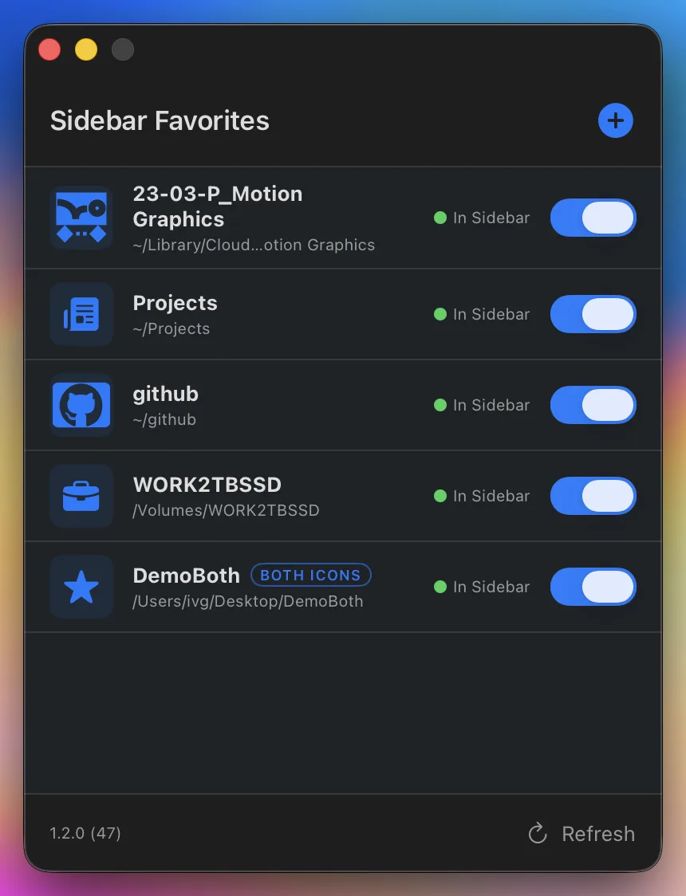
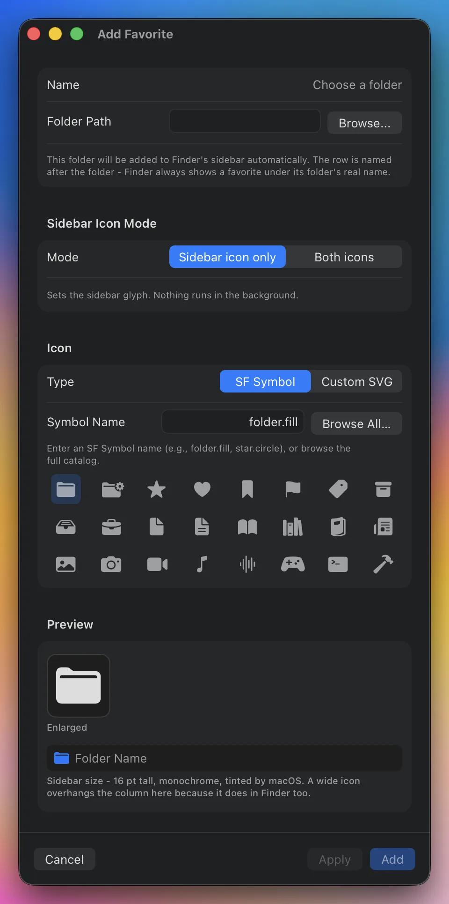
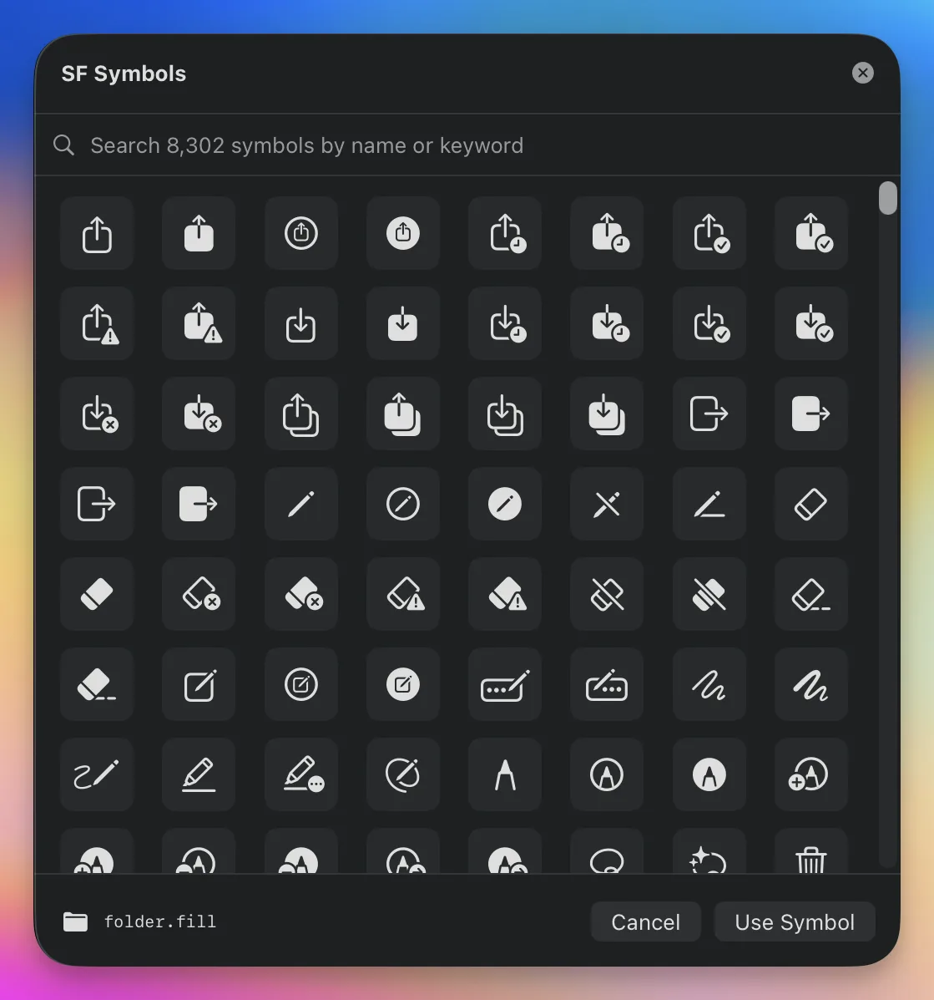
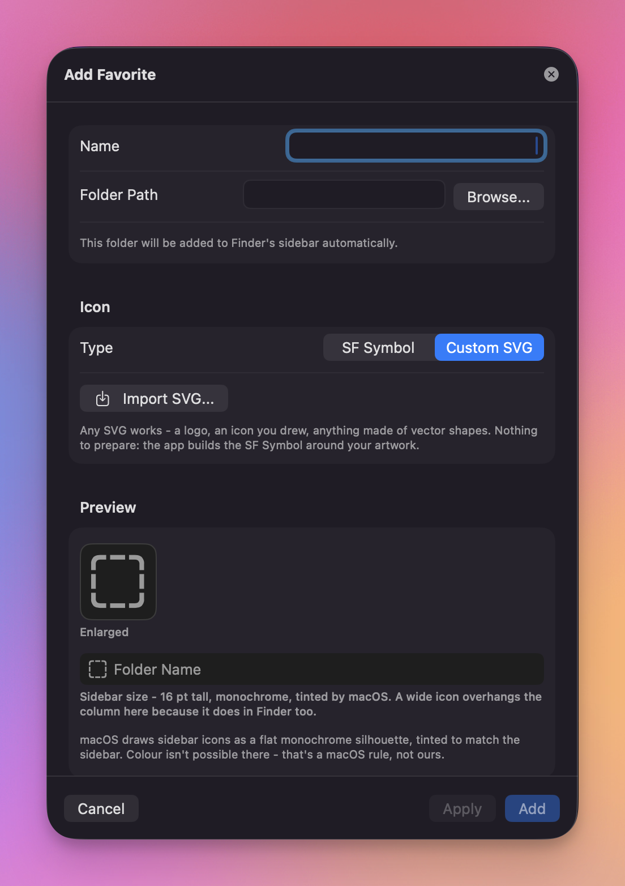
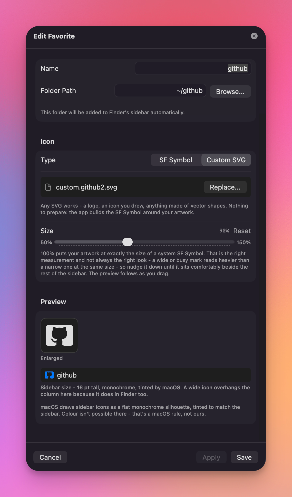
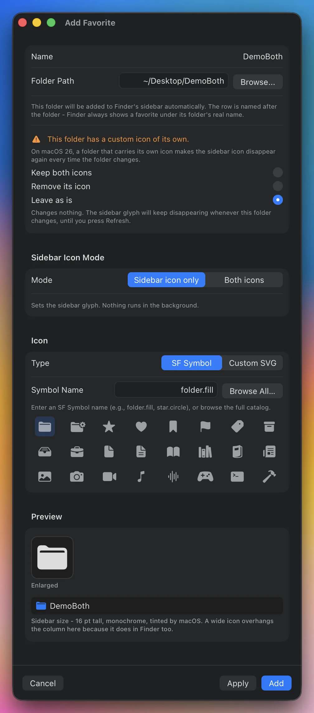
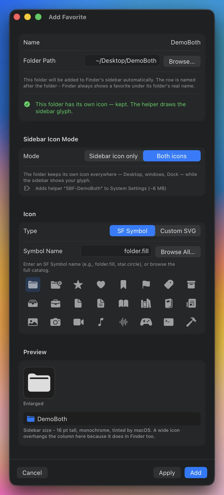
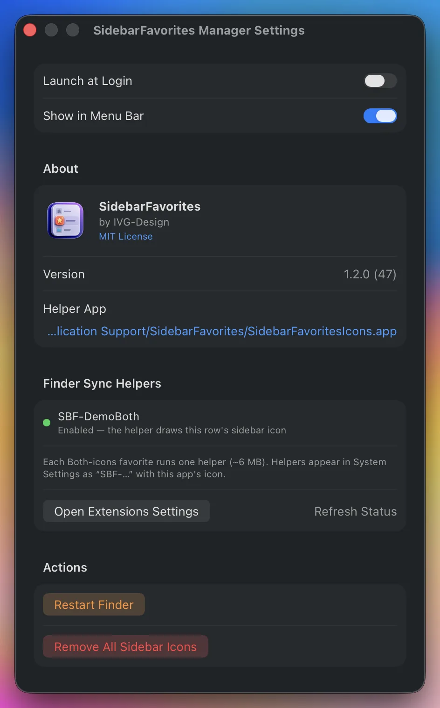
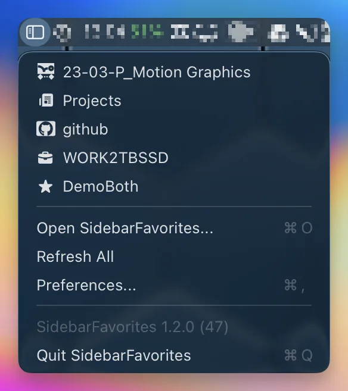

# SidebarFavorites

Give the folders in macOS Finder's sidebar the icons you want, instead of identical grey folders.


## What it does

Pick a folder, pick an icon - any SF Symbol, or any SVG of your own - and SidebarFavorites puts the folder in Finder's sidebar with that icon on it.

- Works for **local folders, iCloud Drive, and `~/Library/CloudStorage`** (Google Drive, Dropbox, OneDrive, …), and for **mounted disks and network shares**.
- **Nothing to enable** in System Settings, and **nothing runs in the background** - icons survive reboots and Finder restarts on their own.
- Folders that carry **an icon of their own** can keep it *and* a sidebar glyph. That one mode is opt-in per favorite and does add a small helper - see [Keeping both icons](#keeping-both-icons).
- The app adds and removes the sidebar row for you. Rows you added yourself are left where they are - it only puts an icon on them.

The app is only needed when you want to add, edit or remove a favorite. Quit it and the icons stay.

## Install

### Homebrew

```sh
brew tap ivg-design/tap
brew trust ivg-design/tap
brew install --cask sidebarfavorites
```

`brew trust` is required once - Homebrew asks you to explicitly trust a
third-party tap before it will load casks from it.

### Direct download

1. Download the latest DMG from [Releases](https://github.com/ivg-design/SidebarFavorites/releases).
2. Drag **SidebarFavorites Manager** to Applications.
3. Open it.

Releases are Developer ID signed, notarized and stapled, so it opens normally - there is no Gatekeeper detour and no "Open Anyway" step.

Requires macOS 13.0 (Ventura) or later.

## Quick start



1. Click **+** (or press ⌘N).
2. Pick the **folder** (Browse, or type a path - `~` works). The name follows the folder, because Finder always labels a favorite with its folder's real name.
3. Choose the icon:
   - **SF Symbol** - type a name like `hammer.fill` or `star.circle`, or click one of the quick picks.
   - **Custom SVG** - click *Import SVG…* and pick any SVG file.
4. **Add**. The folder appears in Finder's sidebar with your icon.

The editor is its own window - move it, resize it, leave it open beside the list.



**Browse All…** searches every SF Symbol this Mac can draw - about 8,300 of them - by name or by keyword, so "bin" finds `trash`.



If Finder is still showing an old icon, a banner appears with a **Restart Finder** button. The app never restarts Finder on its own.

## Custom icons



Import **any ordinary SVG** - a logo, an icon you drew, anything made of vector shapes. There is nothing to prepare: no SF Symbols template to export, no guide boxes to draw inside, no naming field to get right. The app parses the file, flattens it to a single outline and builds the SF Symbol around it.

- **Live preview.** You see the exact silhouette that will ship, both enlarged and in a mock sidebar row at the real 16 pt size.
- **Size slider (50-150%).** 100% is exactly the size of a system SF Symbol - the right measurement, not always the right look, since a wide or busy mark reads heavier than a sparse one at the same size. Nudge it until it sits comfortably next to the rest of the sidebar; the preview follows as you drag.
- **Apply** saves, rebuilds the icon and restarts Finder in one click without closing the sheet, so you can tune the size against the real sidebar.
- **No Xcode required.** Custom icons are compiled by the asset-catalog engine that ships with macOS itself. (Before 1.1 this needed `actool`, which only exists inside Xcode.)
- The app tells you what it had to drop or flatten: embedded photos and PNGs (a symbol cannot contain raster), live text that was never outlined, colours and gradients, and artwork too fine, too dense or too wide to read at sidebar size. These are warnings, not rejections.



> **Sidebar icons are always monochrome.** Finder draws them as a flat silhouette tinted to match the sidebar. Colour is impossible there - that is a macOS rule, not a limitation of this app. The preview shows you the silhouette, so there are no surprises.

## Cloud folders

Folders in iCloud Drive and `~/Library/CloudStorage` work exactly like local ones. **This did not work in any version before 1.0** - those paths are virtual FileProvider mounts that Finder Sync extensions cannot see, and the old mechanism depended on such an extension. The symlink workaround the old README described is no longer needed; if you set one up, the favorite pointing at it keeps working, and you can also just point it at the real folder now.

## Disks and network shares

A mounted disk or server can carry a custom icon too. Finder already lists every mounted volume under **Locations**, so a volume favorite offers a choice:

- **Leave it off** and the app adds a row under Favorites and icons Finder's Locations row to match, so both agree.
- **Show in Locations only** and no Favorites row is added at all - the app just icons the row Finder already shows.

Finder owns the rows in Locations, so the app only ever patches one in place. It never inserts, moves or deletes a row there, and the row is handed back untouched when the favorite is disabled or removed. Finder's synthesised entries - iCloud Drive, Computer, AirDrop, Network and the cloud-provider rows - cannot take a custom icon at all; macOS stores one and never draws it, so the app leaves them alone.

## Keeping both icons

Some folders already have **an icon of their own** - the kind you paste into Get Info, usually so the folder is recognisable in the Dock. On macOS 26 that icon fights the sidebar: Finder redraws the row from the folder's own icon whenever the folder changes, and the sidebar glyph disappears.

When you add such a folder, the app says so and offers three ways out:



- **Keep both icons** - the folder keeps its icon everywhere (Desktop, Finder windows, the Dock) *and* the row keeps your glyph. Switches this favorite to **Both icons** mode, which adds one small Finder Sync helper for it.
- **Remove its icon** - the folder goes back to a plain icon, which is enough to make the glyph stick. Nothing is deleted until you press Save or Apply, and a copy is kept in `~/Library/Application Support/SidebarFavorites/IconBackups/`.
- **Leave as is** - change nothing, and accept that the glyph disappears whenever the folder changes, until you press **Refresh**.

It is a choice you can change: none of the three does anything until you save, so you can move between them freely - and Cancel leaves the folder untouched.

Folders without an icon of their own are added exactly as before, with no extra questions.

Pick **Keep both icons** and the warning turns into confirmation - Mode switches to *Both icons*, and the line underneath names the helper it will add:



### Both icons mode

Each Both-icons favorite runs one helper - about 6 MB, no window, nothing at login. It appears in **System Settings › General › Login Items & Extensions** as `SBF-<favorite name>` with this app's icon, and the app's Settings shows whether each one is actually enabled:



You can switch a favorite between modes at any time in its editor; switching back removes the helper, and the row falls straight back to the normal sidebar icon. SF Symbols and custom SVGs work the same in both modes.

The result: the folder keeps its own icon in Finder windows and the Dock, while its sidebar row shows your glyph.

## How it works

Every row in Finder's Favorites list can carry a private per-item property, `com.apple.LSSharedFileList.OverrideIcon.OSType`, holding a four-character code. Finder resolves that code to an icon through Launch Services. SidebarFavorites allocates one such code per favorite, sets it on the row, and installs a single small helper bundle at:

```
~/Library/Application Support/SidebarFavorites/SidebarFavoritesIcons.app
```

That bundle declares one UTI per favorite, tagging it with the favorite's code and pointing it at an SF Symbol. It contains **no executable code of any kind** - its "executable" is a 17-byte `#!/bin/sh` no-op that exists only so macOS registers the bundle - and it is never launched. Custom SVGs are compiled into a symbol catalog inside it. That is the whole mechanism for a normal favorite: no extension, no daemon, no login item, no launch agent.

**Both icons** mode adds one thing, and only for the favorites you turn it on for. Finder draws a sidebar row from a completely separate source when a Finder Sync extension claims that folder: the extension's containing app icon. That path ignores the folder's own icon entirely, which is why the glyph survives. So the app generates one tiny host app plus extension per Both-icons favorite in `~/Library/Application Support/SidebarFavorites/AdvancedApps/`, carrying that favorite's artwork as its symbol. The host quits itself a few seconds after registering; only the extension stays, at about 6 MB. The normal icon code is left on the row underneath, so if the helper is ever disabled the row falls back to it immediately.

Configuration lives in `~/Library/Application Support/SidebarFavorites/config.json`, and imported artwork in `Icons/` alongside it. Settings links straight to the helper bundle so you can see it for yourself.

Every favorite is also one click away from the menu bar, with its icon:



## Uninstalling

1. In the app, delete your favorites. This removes the sidebar rows the app added and restores the original icon on rows you added yourself. (Settings → **Remove All Sidebar Icons** does the same in one step, and also deletes the helper bundle and any Both-icons helpers; it tells you exactly what it will do first.)
2. Drag **SidebarFavorites Manager** to the Trash.
3. Optionally delete `~/Library/Application Support/SidebarFavorites`.

Do step 1 before step 2 if you used **Both icons** mode. Dragging the app to the Trash runs none of its code, so its helpers stay registered and keep appearing in System Settings until you remove them there or delete `~/Library/Application Support/SidebarFavorites`. Each one says in its description that it is safe to disable if SidebarFavorites is gone.

## Building from source

Requires Xcode 15+ and [XcodeGen](https://github.com/yonaskolb/XcodeGen).

```bash
git clone https://github.com/ivg-design/SidebarFavorites.git
cd SidebarFavorites
brew install xcodegen        # if needed
xcodegen generate
xcodebuild -scheme SidebarFavoritesManager -configuration Release
```

To produce a distributable DMG:

```bash
./scripts/build-release.sh
```

The script finds a **Developer ID Application** identity in your keychain and signs with it (hardened runtime, timestamped), falling back to ad-hoc signing with a warning if there is none. Override it with `SIGN_IDENTITY="Developer ID Application: Your Name (TEAMID)"`.

Notarization runs automatically when a Developer ID identity *and* a notarization keychain profile are both available; set `NOTARIZE=0` to skip it. The profile defaults to `SidebarFavoritesNotary` (override with `NOTARY_PROFILE`) and is created once per machine - run this yourself in Terminal, it stores an app-specific password in your keychain:

```bash
xcrun notarytool store-credentials SidebarFavoritesNotary \
    --apple-id "you@example.com" \
    --team-id "TEAMID" \
    --password "app-specific-password"
```

### Nix (flakes)

```bash
nix run github:ivg-design/SidebarFavorites
```

This installs the released DMG rather than building from source, and `nix/default.nix` is currently pinned to an older release. *Thanks to [@rohanp2051](https://github.com/rohanp2051) for the initial Nix package.*

## Documentation

- [Architecture](docs/ARCHITECTURE.md) - how the icon mechanism, the SVG pipeline and the migration work, for contributors.
- [Changelog](CHANGELOG.md)

## Credits

- Inspired by [rknightuk/custom-finder-sidebar-icons](https://github.com/rknightuk/custom-finder-sidebar-icons)
- Uses Apple's SF Symbols

## License

MIT - see [LICENSE](LICENSE).

---

**Note**: This project is not affiliated with Apple Inc. SF Symbols is a trademark of Apple Inc.
